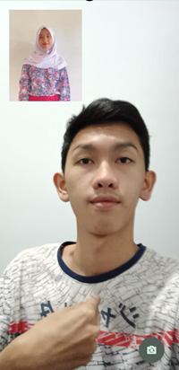

# IMPLEMENTASI TEKNOLOGI AUGMENTED REALITY PADA PHOTOBOOTH INTERAKTIF TANPA KAMERA PEMINDAI KEDALAMAN UNTUK MENINGKATKAN PENGALAMAN PENGGUNA DALAM APLIKASI JELITA

Proyek yang akan dibuat adalah sebuah  aplikasi mobile JELITA untuk photobooth yang interaktif dengan menggunakan teknologi Augmented Reality (AR) tanpa memerlukan kamera depth sensing. Aplikasi ini akan memanfaatkan body tracking dan AR untuk memberikan pengalaman photobooth yang lebih menarik dan interaktif bagi pengguna. Proyek ini dibuat didasari dengan permasalahan yang terjadi pada pameran yang menggunakan photobooth dengan depth sensing camera, bahwa mereka kesulitan jika harus selalu membeli camera depth sensing untuk photobooth.

Tampilan Utama                              | Tampilan Kata                              | Tampilan Praktik
--------------------------------------------|--------------------------------------------|--------------------------------------------
||

### Link Berkas PA

https://docs.google.com/document/d/1TFoFSJ4JaZrGYUar_MFSpBhZqXw8WqJtDmAe1z2s8LE/edit?tab=t.0

### Susunan Tim

Nama            | Username Github | Posisi
----------------|-----------------|-----------
Adam Aria Rahman | usernameMhs1    | Mahasiswa
Khalilah Atika Akmal | khalilahatika   | Mahasiswa
Fat’hah Noor Prawita | usernamePbb     | Pembimbing
Nama Reviewer   | usernameRev     | Reviewer
